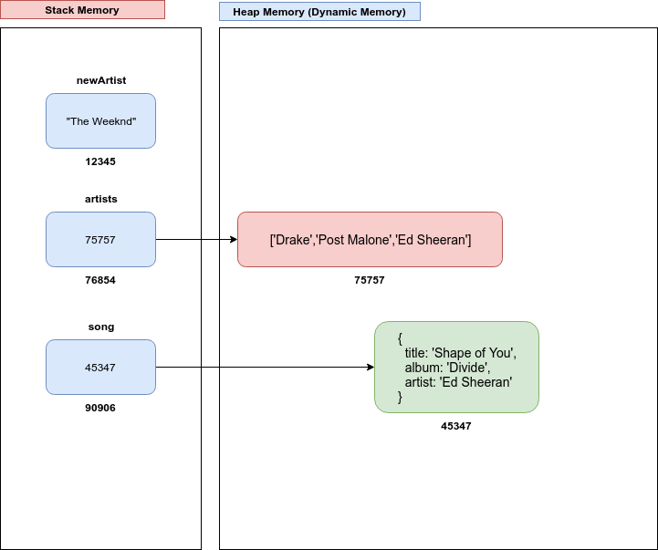

# D1D3 - Lecture

## How do you comfort a JavaScript bug?

- You console it!

## Types in JavaScript

- We can use **typeof** to find out the type of something

```
var movie = "Lord of the rings";

console.log(movie, typeof(movie));

var numberOfRings = 20;

console.log(numberOfRings, typeof(numberOfRings));

var elvesRings = 3 / 20;

console.log(elvesRings, typeof(elvesRings));

var allIsLost = false;

console.log(allIsLost, typeof(allIsLost));

var whoIsGullum;

console.log(whoIsGullum, typeof(whoIsGullum));

var fellowship = null;

console.log(fellowship, typeof(fellowship));
```

- All these types are called primitive data types

### Primitive Data Types

1. string
2. number
3. boolean
4. null
5. undefined
6. symbol (es6)

### Everything Else is an Object

```
var artists = ['Drake', 'Post Malone', 'Ed Sheeran'];

console.log(typeof(artists));

var song = {
  title: 'Shape of you',
  album: 'divide',
  artist: 'Ed Sheeran'
}

console.log(typeof(song));

```

### Object Types

- Non primitive data types such as array and objects are objects
- Even function are objects!

```
function whatAmI () {
  this.also = "and can have properties also";
  return "Functions are objects" + " " + this.also;
}

whatAmI();

whatAmI.func = "I am a function";

console.log(whatAmI.func);
```

### Difference Between Primitive and Non Primitive Types

```
var artists = ['Drake', 'Post Malone', 'Ed Sheeran']
var best2018Artist = artists[0];
var topArtist = best2018Artist;
topArtist = artists[1];

console.log(best2018Artist, topArtist);
```

- best2018Artist doesn't change when we modify topArtist

```
var artists = ['Drake', 'Post Malone', 'Ed Sheeran']

var top3Artists = artists;

top3Artists[2] = "Cardi B";

console.log(artists);
```

- By changing top3Artists we are also changing the content of artists! Why is that?

- Primitive types are called **Value Types**
- Non primitive types are called **Reference Types**
- Primitive types are passed by value and non primitive types are passed by reference

```
function addTopArtist(artists, topArtist) {
  topArtist = 'Cardi B';
  artists.push(topArtist);

}

var artists = ['Drake', 'Post Malone', 'Ed Sheeran']

var newArtist = 'The Weeknd'

addTopArtist(artists, newArtist);

console.log(artists, newArtist);

```

- The artists array has been modified by the function while newArtist retained its original value. Let's see how this works:



### Copying Objects

- What if you want to copy the content of an Array or Object instead of copying the reference

- Copy an array

```
var artists = ['Drake', 'Post Malone', 'Ed Sheeran']

var top3Artists = artists; // This copy the reference. Pointing to the same array.

top3Artists = artists.slice(); // Makes a copy of the array

artists.push('Cardi B');

console.log(artists, top3Artists);
```

- Copy an object

```
var song = {
  title: 'The Shape of You',
  album: 'Divide',
  artist: 'Ed Sheeran'
}

var topSong = song; // this is copying the reference, pointing to the same object

topSong = Object.assign({}, song); // This make a copy of the song object. 2 independant references.

topSong.title = topSong.title.toUpperCase();

console.log(topSong, song);
```

- Caveat with copying objects: it does only a shallow copy and not a deep copy ie it does not copy the array of a property

```
  var songs = {
    titles: ['Shape of You', 'Perfect','Dive'],
    album: 'Divide',
    artist: 'Ed Sheeran',
  }

topSongs = Object.assign({}, songs); // This make a copy of the song object. 2 independant references.

topSongs.titles.push('Eraser'); // this modifies both objects

console.log(topSongs, songs);
```

#### Take Aways

1. Primitive types are immutable

```
var fruit = "Mango"

fruit.toUpperCase();
fruit[0] = 'J'

console.log(fruit); // Still print 'Mango'
```

2. Primitive types are compared/copied by value

3. Objects are compared/copied by reference

4. Primitive types are kept in _Stack Memory_

- Simple data that does not take a lot of memory
- Faster access

5. Objects are kept in _Heap Memory_

- Memory that is dynamically allocated
- More complex data that can take more memory
- Slower than Stack Memory
- Unused objects are cleaned up with garbage collection

## JavaScript Objects

### Object Data Structure

Objects are key value pairs. In other languages, you might have heard of dictionary, hash, associative array, etc.

### Create an Object

#### Object Litteral

```
var actor = {}; // this creates an empty object

var movie = {
  title: "Black Panther",
  year: 2018,
  genre: 'action'
}

```

#### Access Properties of an Object

- 2 ways:
  1. dot notation
  2. bracket notation

```
movie.title;
movie.year;
movie.genre;

// OR

movie['title];
movie['year'];
movie['genre'];

```

- What do we get when we try to access a property that doesn't exist?

```
console.log(movie.rating) // prints 'undefined'
```

#### Add Properties to an Object

- You can add an entry to an object by providing a value to a none existant key

```
var movie = {};
movie.title = 'The Lord of the rings';
movie.year =  2001;
movie.genre = 'fantasy';
```

#### Example

```
var words = ['axel','onyx','boxy','axon', 'hello'];

function findPosX(list) {
  var xPos = {};

  for (var i=0; i < list.length; i++) {
    xPos[list[i]] = list[i].indexOf('x');
  }
  return xPos;
}

console.log(findPosX(words));
```

#### How to Test if a Value Exists?

- A value that doesn't exist will return 'undefined'

```js
var weather = [
  'sun',
  'rain',
  'sun',
  'rain',
  'rain',
  'rain',
  'cloudy',
  'foggy',
  'foggy',
];

function weatherStat(weatherArr) {
  var weatherObj = {};
  // weatherObj.sun = 0;
  // weatherObj.rain = 0;
  // weatherObj.cloudy = 0;

  // for (var i=0; i < weatherArr.length; i++) {
  //   var dayForecast = weatherArr[i];
  //   weatherObj[dayForecast] = 0;
  // }

  for (var i = 0; i < weatherArr.length; i++) {
    var dayForecast = weatherArr[i];

    weatherObj[dayForecast] = weatherObj[dayForecast] || 0;
    weatherObj[dayForecast] += 1;

    // if (weatherObj[dayForecast]) {
    // } else {
    //   weatherObj[dayForecast] =1;
    // }
  }

  return weatherObj;
}

weatherStat(weather);
```

#### Iterate Over Key Value Pairs

- Use any loop intended for arrays
- Use `for in` loop

- Using Object.keys

```
var movie = {
  title: 'The Lords of the Ring',
  year: 2001,
  director: 'Peter Jackson',
  budget: '93 million USD'
}

function printObj(obj) {
  var objKeys = Object.keys(obj);
  for (var i = 0; i < objKeys.length; i++)
    {
      console.log(objKeys[i] + ':   ' + '\t' + obj[objKeys[i]]);
    }
}

printObj(movie);
```

- Using `for in`

```
var movie = {
  title: 'The Lords of the Ring',
  year: 2001,
  director: 'Peter Jackson',
  budget: '93 million USD'
}

function printObj(obj) {
  for (var objKey in obj)
    {
      console.log(objKey + ':   ' + '\t' + obj[objKey]);
    }
}

printObj(movie);
```

## This Keyword

- `this` is a reference to the _"object"_ that _“owns”_ the currently executing code.

  - A function bound to an object has a reference to its context called `this`
  - The global context or window object in the browser has also a reference to `this` (default)
  - You can also set the value of this manually with call, apply, and bind (explicit binding)

Typing `this` at the prompt will give you the global object in node (in strict mode, the default value of this is 'undefined'):

### Implicit Binding

```
> this
{ console: [Getter],
  global: [Circular],
  process:
   process {
     title: 'node',
     version: 'v8.9.4',
     moduleLoadList:
      [ 'Binding contextify',
        'Binding natives',
        'Binding config',
...
```

In the browser, this refers to the window object:

```
> this
Window {postMessage: ƒ, blur: ƒ, focus: ƒ, close: ƒ, parent: Window, …}
```

- an _unbound_ function will default to the global object:

```
function printThis() {
  console.log('this', this);
}

printThis(); // prints the global object in node or window in the browser
```

- The value of this when bound to an object:

```
var printThis = {
  name: 'printThis',
  print: function() { console.log(this)}
}
console.log("Value of this: ");
printThis.print(); // this is equal to the object itself
```

```
var robot = {
  name: 'r2d2',
  sound: 'bip bip bip',
  speak: function() {
    console.log(this.sound);
  }
}

robot.speak(); // prints 'bip bip bip'
```

- The function say has lost the link the context of robot:

```
var say = function() {
    console.log(this.sound);
  }

say(); // this prints 'undefined'
```

- Solution? Explicit binding

### Explicit Binding

#### call and apply

- Call and Apply allow any functions to be executed in a specified context

```
var robot = {
  name: 'r2d2',
  sound: 'bip bip bip',
  speak: function() {
    console.log(this.sound);
  }
}

var say = function() {
    console.log(this.sound);
  }

// say.apply(robot) // or
say.call(robot); // this prints 'bip bip bip'
```

#### bind

- Sets a context permanently to a function

```
var robot = {
  name: 'r2d2',
  sound: 'bip bip bip',
  speak: function() {
    console.log(this.sound);
  }
}

var say = function() {
    console.log(this.sound);
  }.bind(robot);

say(); // this prints 'bip bip bip'
```
